# liquidux 💧🛍️
liquidux : eCommerce Shopify Liquid # open-source template # Ruby # Looker # LookML # UX

## Objective
- To customize the Looker User Experience with Liquid
- To list common use cases for Liquid in Looker.
- To use Liquid to add links to dimensions like web searches, Looker dashboards and Explores, other company applications.
- To use Liquid to customize dimensions and measure values using the html parameter.

## Looker & Liquid 

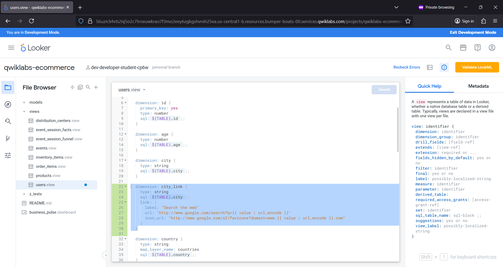

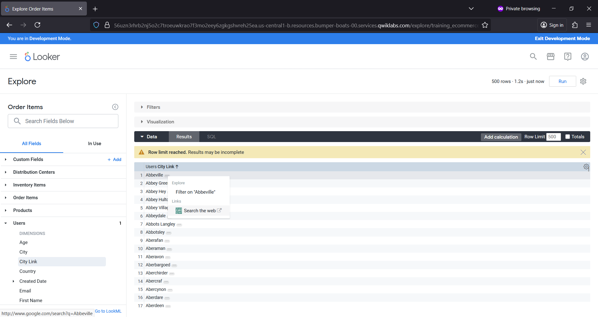

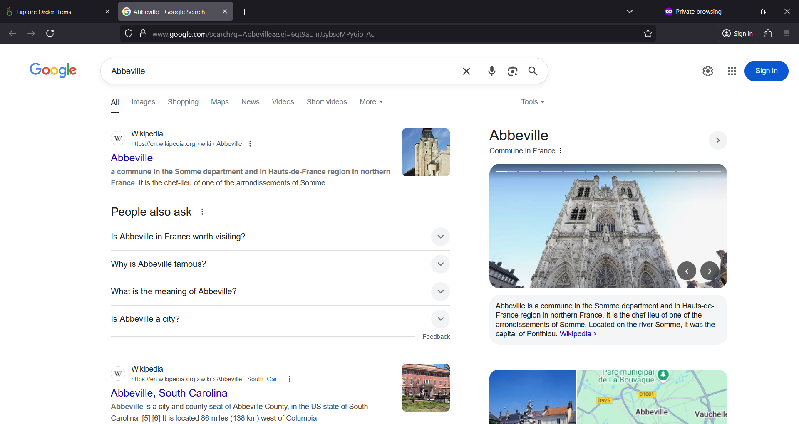

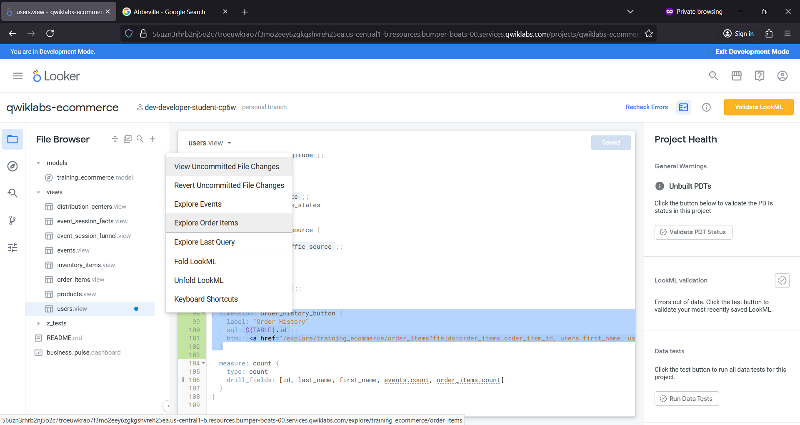

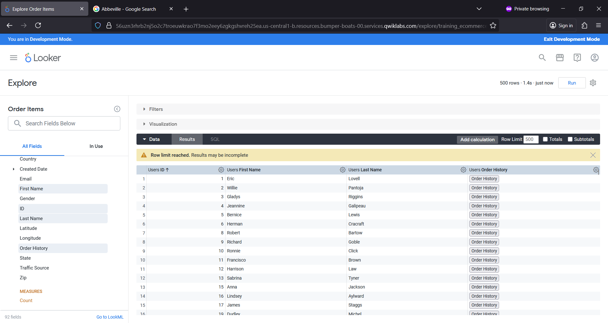

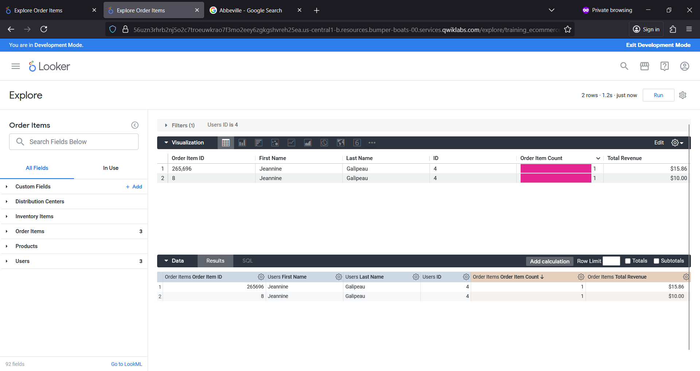

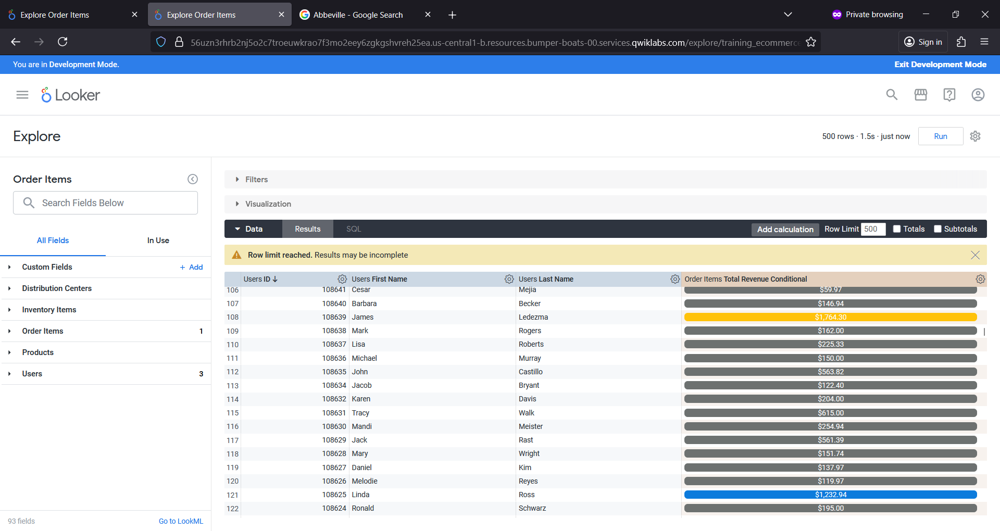

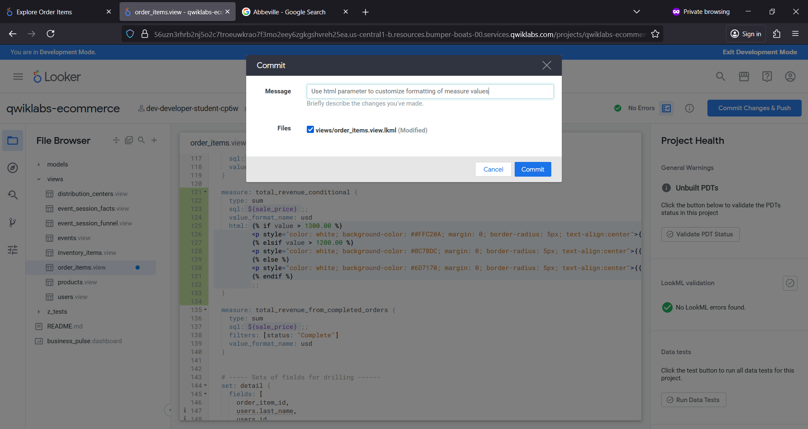

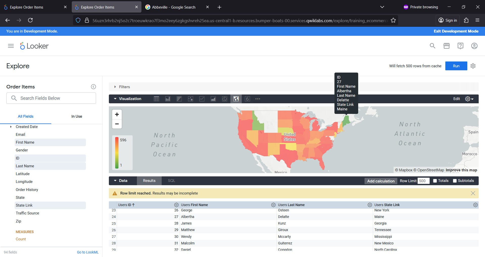

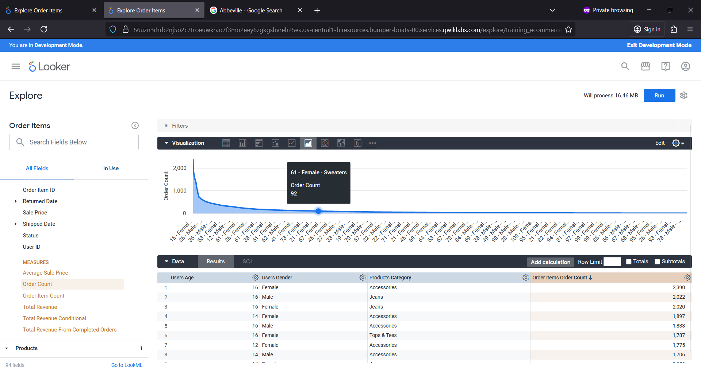

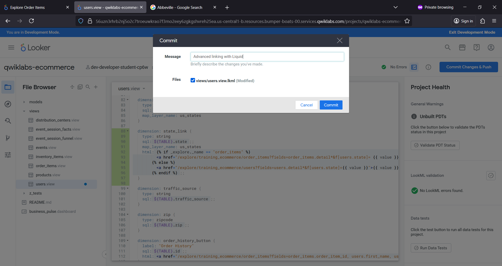

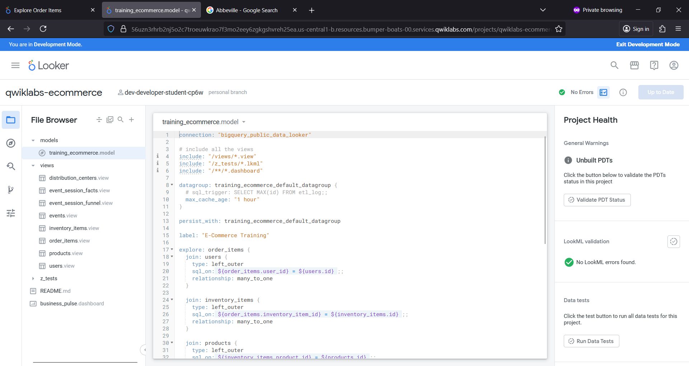

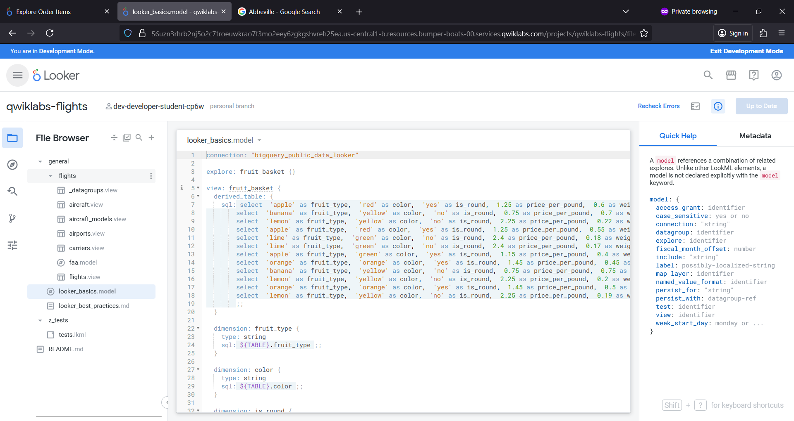
